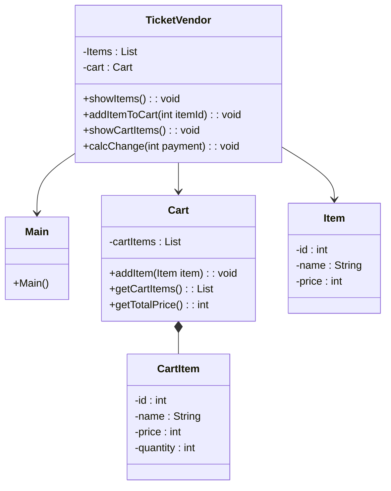
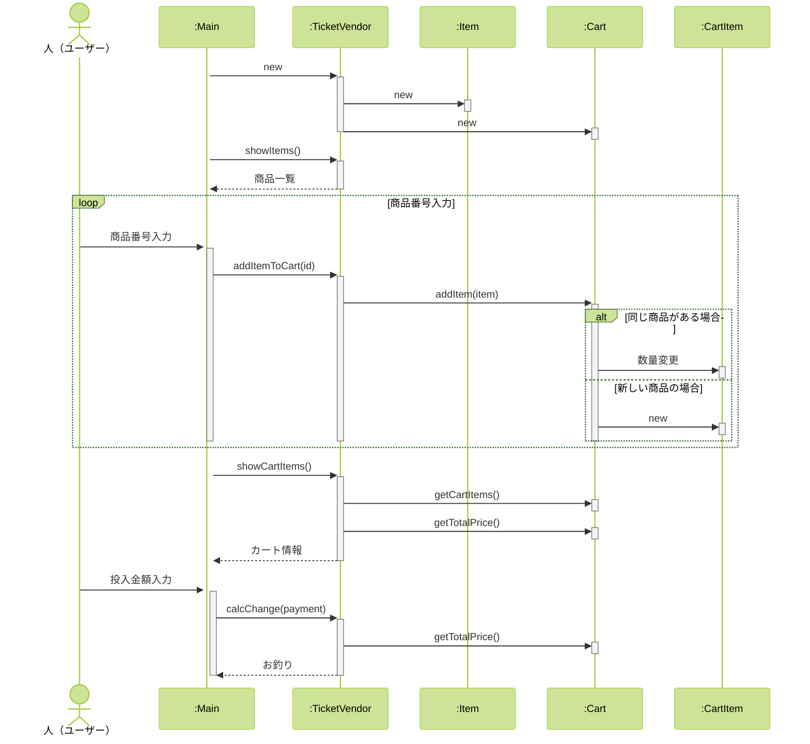

```
@startuml

class TicketVendor {
    - Items : List
    - cart : Cart
    + showItems() : void
    + addItemToCart(itemId : int) : void
    + showCartItems() : void
    + calcChange(payment : int) : void
}

class Main {
    + Main()
}

class Cart {
    - cartItems : List
    + addItem(item : Item) : void
    + getCartItems() : List
    + getTotalPrice() : int
}

class Item {
    - id : int
    - name : String
    - price : int
}

class CartItem {
    - id : int
    - name : String
    - price : int
    - quantity : int
}

TicketVendor --> Main
TicketVendor --> Cart
TicketVendor --> Item
Cart *-- CartItem

@enduml
```

```
@startuml

actor "人（ユーザー）" as ore

participant Main
participant TicketVendor
participant Item
participant Cart
participant CartItem

activate Main

Main -> TicketVendor : new
activate TicketVendor

TicketVendor -> Item : new
activate Item
deactivate Item

TicketVendor -> Cart : new
activate Cart
deactivate Cart

deactivate TicketVendor

Main -> TicketVendor : showItems()
activate TicketVendor

TicketVendor --> Main : 商品一覧
deactivate TicketVendor

loop 商品番号入力

    ore -> Main : 商品番号入力

    Main -> TicketVendor : addItemToCart(id)
    activate TicketVendor

    TicketVendor -> Cart : addItem(item)
    activate Cart

    alt 同じ商品がある場合

        Cart -> CartItem : 数量変更
        activate CartItem
        deactivate CartItem

    else 新しい商品の場合

        Cart -> CartItem : new
        activate CartItem
        deactivate CartItem

    end

    deactivate Cart
    deactivate TicketVendor

end

Main -> TicketVendor : showCartItems()
activate TicketVendor

TicketVendor -> Cart : getCartItems()
activate Cart
deactivate Cart

TicketVendor -> Cart : getTotalPrice()
activate Cart
deactivate Cart

TicketVendor --> Main : カート情報
deactivate TicketVendor

ore -> Main : 投入金額入力

Main -> TicketVendor : calcChange(payment)
activate TicketVendor

TicketVendor -> Cart : getTotalPrice()
activate Cart
deactivate Cart

TicketVendor --> Main : お釣り

deactivate TicketVendor
deactivate Main

@enduml
```

