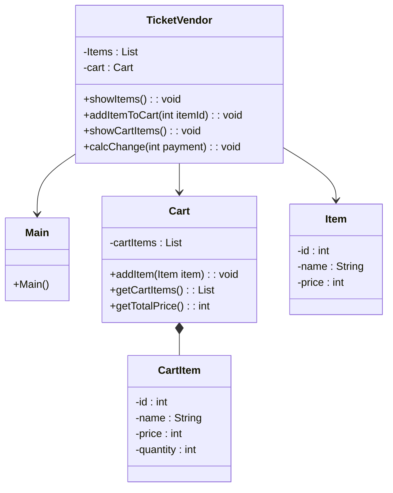

```
---
config:
  theme: forest
---
sequenceDiagram
    actor ore as 人（ユーザー）
    participant Main as :Main
    participant TicketVendor as :TicketVendor
    participant Item as :Item
    participant Cart as :Cart
    participant CartItem as :CartItem

    activate Main
    Main->>+TicketVendor: new
    TicketVendor->>+Item: new
    TicketVendor-->>-Item: 
    TicketVendor->>+Cart: new
    TicketVendor-->>-Cart: 
    TicketVendor-->>-Main: 

    Main->>+TicketVendor: showItems()
    TicketVendor-->>-Main: 

    loop 商品番号入力
        ore->>+Main: 商品番号入力
        Main->>+TicketVendor: addItemToCart(id)
        TicketVendor->>+Cart: addItem(item)
        
        opt 同じ商品がある場合は数量を変更する
            Cart->>+CartItem: new
            CartItem-->>-Cart: 
        end
        
        Cart-->>-TicketVendor: 
        TicketVendor-->>-Main: 
        Main-->>-ore: 
    end

    Main->>+TicketVendor: showCartItems()
    TicketVendor->>+Cart: getCartItems()
    Cart-->>-TicketVendor: 
    TicketVendor->>+Cart: getTotalPrice()
    Cart-->>-TicketVendor: 
    TicketVendor-->>-Main: 

    ore->>+Main: 投入金額入力
    Main->>+TicketVendor: calcChange(payment)
    TicketVendor->>+Cart: getTotalPrice()
    Cart-->>-TicketVendor: 
    TicketVendor-->>-Main: 
    Main-->>-ore: 

    deactivate Main
```
