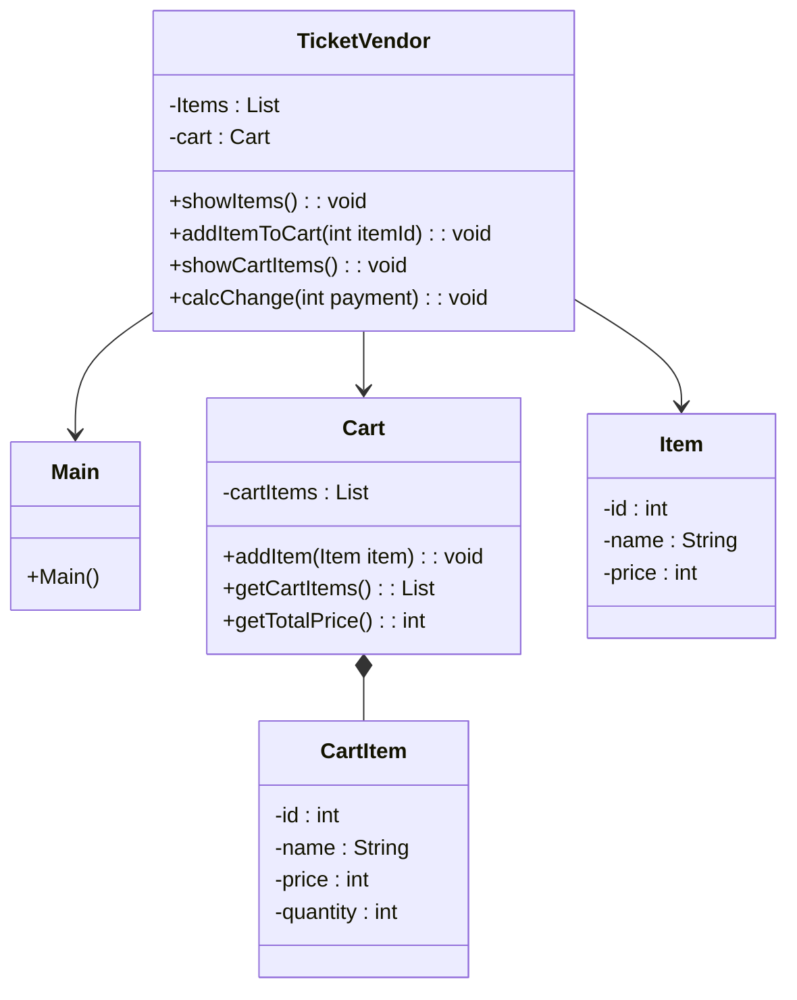

```mermaid
---
config:
  theme: forest
---
sequenceDiagram

    actor ore as 人（ユーザー）
    participant Main as :Main
    participant TicketVendor as :TicketVendor
    participant Item as :Item
    participant Cart as :Cart
    participant CartItem as :CartItem

    activate Main

    Main->>+TicketVendor: new

    TicketVendor->>+Item: new
    deactivate Item

    TicketVendor->>+Cart: new
    deactivate Cart
    deactivate TicketVendor

    Main->>+TicketVendor: showItems()
    TicketVendor-->>-Main: 商品一覧

    loop 商品番号入力

        ore->>+Main: 商品番号入力

        Main->>+TicketVendor: addItemToCart(id)

        TicketVendor->>+Cart: addItem(item)

        opt 同じ商品がある場合

            Cart->>+CartItem: 数量変更
            deactivate CartItem

        else 新しい商品の場合

            Cart->>+CartItem: new
            deactivate CartItem

        end

        deactivate Cart
        deactivate TicketVendor
        deactivate Main

    end

    activate Main

    Main->>+TicketVendor: showCartItems()

    TicketVendor->>+Cart: getCartItems()
    deactivate Cart

    TicketVendor->>+Cart: getTotalPrice()
    deactivate Cart

    TicketVendor-->>-Main: カート情報

    ore->>+Main: 投入金額入力

    Main->>+TicketVendor: calcChange(payment)

    TicketVendor->>+Cart: getTotalPrice()
    deactivate Cart

    TicketVendor-->>-Main: お釣り

    deactivate Main
```
